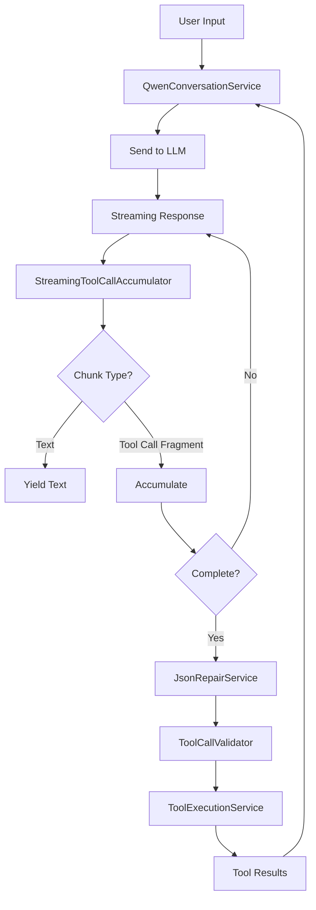

# Qwen Model Integration Implementation Plan

## Overview
This document outlines the plan to replace the current Andy CLI implementation with a robust system inspired by qwen-code's approach for handling Qwen model responses, particularly focusing on streaming responses and incomplete JSON handling.

## Current State Analysis

### Existing Components (To Be Replaced/Enhanced)
1. **AiConversationService** - Basic conversation handling without proper streaming support
2. **ModelResponseInterpreter** - Simple regex-based tool call extraction
3. **ToolExecutionService** - Basic tool execution without validation
4. **ParameterMapper** - Simple parameter mapping

### Key Issues with Current Implementation
- No handling of incomplete/malformed JSON from streaming responses
- Regex-based tool call extraction is fragile
- No accumulation of partial tool calls during streaming
- Missing validation and error recovery
- No proper handling of tool call IDs for correlation

## New Architecture Design

### Core Components

#### 1. JsonRepairService
**Purpose**: Handle malformed JSON from model responses
```csharp
public interface IJsonRepairService
{
    T SafeParse<T>(string json, T fallback = default);
    bool TryRepairJson(string malformedJson, out string repairedJson);
}
```
**Implementation Notes**:
- Use Newtonsoft.Json.Schema for validation
- Implement custom repair logic for common Qwen issues:
  - Unclosed brackets/braces
  - Missing quotes
  - Trailing commas
  - Incomplete property values

#### 2. StreamingToolCallAccumulator
**Purpose**: Accumulate partial tool calls during streaming
```csharp
public class StreamingToolCallAccumulator
{
    private Dictionary<int, AccumulatedToolCall> _streamingCalls;
    
    public void AccumulateChunk(StreamChunk chunk);
    public List<ToolCall> GetCompletedCalls();
    public void Clear();
}

public class AccumulatedToolCall
{
    public string? Id { get; set; }
    public string? Name { get; set; }
    public StringBuilder Arguments { get; set; }
    public bool IsComplete { get; set; }
}
```

#### 3. QwenResponseParser
**Purpose**: Parse Qwen model responses with proper error handling
```csharp
public interface IQwenResponseParser
{
    ParsedResponse Parse(string response);
    ParsedResponse ParseStreaming(IAsyncEnumerable<string> chunks);
}

public class ParsedResponse
{
    public string TextContent { get; set; }
    public List<ToolCall> ToolCalls { get; set; }
    public ResponseMetadata Metadata { get; set; }
    public List<ParseError> Errors { get; set; }
}
```

#### 4. ToolCallValidator
**Purpose**: Validate tool calls against registered tool schemas
```csharp
public interface IToolCallValidator
{
    ValidationResult Validate(ToolCall call, ToolMetadata metadata);
    ToolCall RepairParameters(ToolCall call, ToolMetadata metadata);
}
```

#### 5. QwenConversationService
**Purpose**: Replace AiConversationService with streaming-aware implementation
```csharp
public class QwenConversationService
{
    private readonly IQwenResponseParser _parser;
    private readonly IToolCallValidator _validator;
    private readonly StreamingToolCallAccumulator _accumulator;
    private readonly IJsonRepairService _jsonRepair;
    
    public async IAsyncEnumerable<ConversationChunk> ProcessStreamingAsync(
        string message, 
        CancellationToken ct);
}
```

### Integration Flow



## Implementation Phases

### Phase 1: Core Infrastructure (Week 1)
1. **JsonRepairService**
   - Install required NuGet packages
   - Implement JSON repair logic
   - Unit tests with malformed JSON samples

2. **StreamingToolCallAccumulator**
   - Implement accumulation logic
   - Handle chunk boundaries
   - Unit tests with partial chunks

### Phase 2: Response Parsing (Week 1-2)
1. **QwenResponseParser**
   - Implement streaming parser
   - Handle <tool_call> tags
   - Support both streaming and non-streaming modes
   - Integration with JsonRepairService

2. **ToolCallValidator**
   - Schema validation
   - Parameter type coercion
   - Default value handling

### Phase 3: Service Integration (Week 2)
1. **QwenConversationService**
   - Replace AiConversationService
   - Implement streaming pipeline
   - Error recovery mechanisms
   - Context management

2. **Update ToolExecutionService**
   - Support new tool call format
   - Better error reporting
   - Async streaming results

### Phase 4: Testing & Polish (Week 3)
1. **Comprehensive Testing**
   - Unit tests for all components
   - Integration tests with mock responses
   - Real Qwen model testing
   - Edge case handling

2. **Documentation**
   - API documentation
   - Migration guide
   - Usage examples

## Key Design Patterns from qwen-code

### 1. Streaming Accumulation Pattern
```typescript
// qwen-code approach
streamingToolCalls.set(index, {
    id: accumulated.id || chunk.id,
    name: accumulated.name || chunk.name,
    arguments: accumulated.arguments + chunk.arguments
});
```

### 2. JSON Repair with Fallback
```typescript
// qwen-code approach
try {
    return JSON.parse(jsonString);
} catch {
    const repaired = jsonrepair(jsonString);
    return JSON.parse(repaired);
}
```

### 3. Tool Call Completion Detection
```typescript
// Only emit when finish_reason present
if (choice.finish_reason) {
    emitCompletedToolCalls();
}
```

## Dependencies

### Required NuGet Packages
- `Newtonsoft.Json` (already installed)
- `Newtonsoft.Json.Schema` - For JSON validation
- `JsonRepairSharp` or custom implementation
- `Microsoft.Extensions.ObjectPool` - For pooling StringBuilder objects

### Modified Packages
- Update `Andy.Llm` to support streaming chunks
- Enhance `Andy.Tools.Core` for better metadata

## Migration Strategy

1. **Parallel Development**
   - Develop new components alongside existing ones
   - Use feature flags to switch between implementations

2. **Gradual Rollout**
   - Start with JsonRepairService (immediate benefit)
   - Add StreamingToolCallAccumulator for specific models
   - Full replacement when stable

3. **Backward Compatibility**
   - Keep ModelResponseInterpreter as fallback
   - Support both old and new tool call formats
   - Gradual deprecation of old components

## Success Metrics

1. **Reliability**
   - 95% success rate for tool call parsing
   - Handle 99% of malformed JSON cases
   - Zero data loss during streaming

2. **Performance**
   - < 10ms overhead for JSON repair
   - Streaming latency < 50ms per chunk
   - Memory usage < 100MB for long conversations

3. **Developer Experience**
   - Clear error messages
   - Comprehensive logging
   - Easy debugging of tool calls

## Risk Mitigation

1. **JSON Repair Complexity**
   - Risk: Repair logic becomes too complex
   - Mitigation: Start with common cases, add patterns gradually

2. **Streaming State Management**
   - Risk: State corruption during streaming
   - Mitigation: Immutable accumulator pattern, clear ownership

3. **Breaking Changes**
   - Risk: Existing functionality breaks
   - Mitigation: Feature flags, comprehensive testing, gradual rollout

## Timeline

- **Week 1**: Core infrastructure (JsonRepair, Accumulator)
- **Week 2**: Parser and Validator implementation
- **Week 3**: Service integration and testing
- **Week 4**: Documentation and deployment

## Next Steps

1. Review and approve this plan
2. Set up development branch
3. Install required NuGet packages
4. Begin Phase 1 implementation
5. Create test data from real Qwen responses

## References

- qwen-code source: `/Users/samibengrine/Devel/qwen-code/packages/core/src/core/openaiContentGenerator.ts`
- JSON repair library: `jsonrepair` (TypeScript) - need C# equivalent
- Streaming patterns: OpenAI SDK streaming implementation